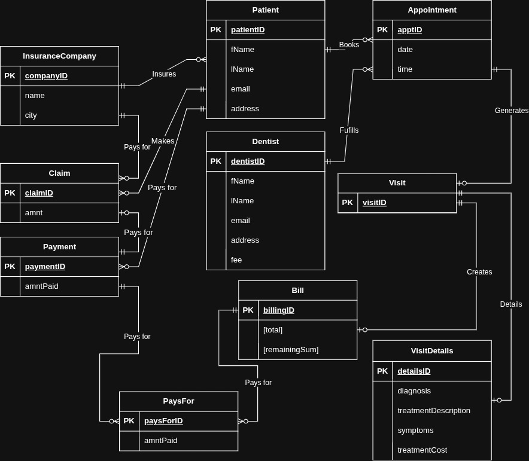
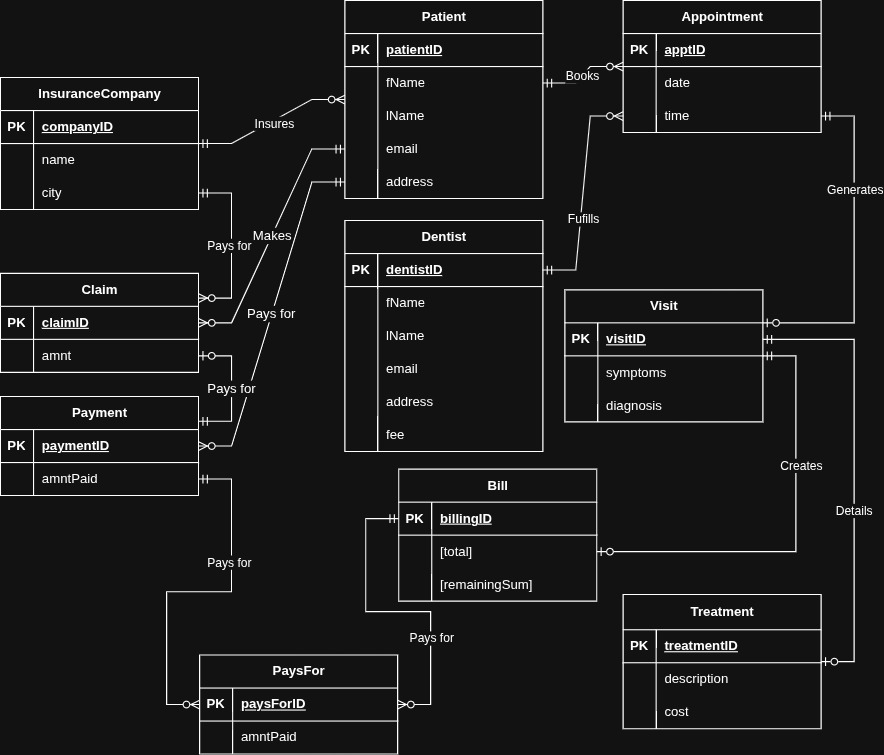
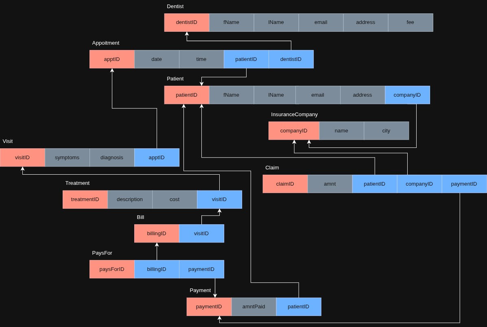

# Database-LIA Deliverable 2 Report
***Authored by Mathieu Bernardin, with contributions from Kiavash Emrani***
## Sec. 1: Revisions made to Deliverable 1
- Added relationship names
- Removed foreign keys
- Removed *Dentist* - *Bill* relationship
- Added *Patient* - *InsuranceCompany*
- Collapsed *Treatment*, *Treats*, *Diagnosis*, and *Perscribes* into *Visit Details*
- Added logical schema*

***Fig 1. Revised Entity Relationship Diagram***

*Logical schema complete after normalization; See section 2.1 for details

## Sec 2: Normalization Details
### Sec 2.1: Current Normalization Analysis
1. Already in 1NF
   1. All records are unqiue
   2. All columns contain only atomic values
2. Already in 2NF
   1. No composite keys; No partial dependancies
3. Not in 3NF
   1. Contains one transitive dependency

### Sec 2.2: Solution
A transitive dependency is present on *VisitDetails*, where `treatmentCost` is dependent entirely and solely on `treatmentDescription`. To solve this, we will rename *VisitDetails* to *Treatment* and split `symptoms` and `diagnosis` off into *Visit*. A foreign key, `treatmentID`, will be created in *Visit* to link the tables. The relationship will remain unchanged as each visit will have a unique, specific to the conditions of the patient.

***Fig 3. Normalized Entity Relationship Diagram***

***Fig 4. Normalized Logical Schema***

## Sec 3: Difficulties and Challenges
During deliverable 2, our team continued to face many difficulties. Chief among them was coordinating on what exactly to do and when to do it. Due to this we ended up facing a considerable time crunch in the last few hours before submission. 

In terms of database design, we encountered a few challenges when reviewing our design from Deliverable 1. Namely, we had a majort revision to the way we are modeling treatments and diagnosis. However, this was resolved fairly rapidly by completely changing the way we were understanding the assignment.

With this Deliverable we continued to use a GitHub repository, which was hugely heplful in checking in on each others progress, and making sure we both were working with the same version of the files. The repository contains other insightful documents, such as full size versions of the diagrams, and can be found [here](https://github.com/m-bernardin/Database-LIA).

## Sec 4: Teamwork Summary
### Sec 4.1: Work by Mathieu Bernardin
- Revisions to Entity Relationship Diagram
- Normalization to 3NF
- Database Schema
- Revisions to Logical Schema
- Index creation
- Report

### Sec 4.2: Work by Kiavash Emrani
- Data insertion using DML
- Sequence creation
- Alter statements